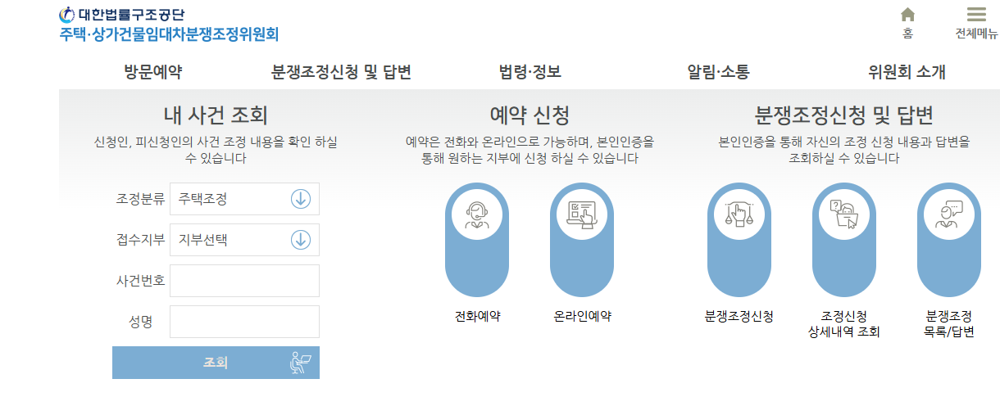
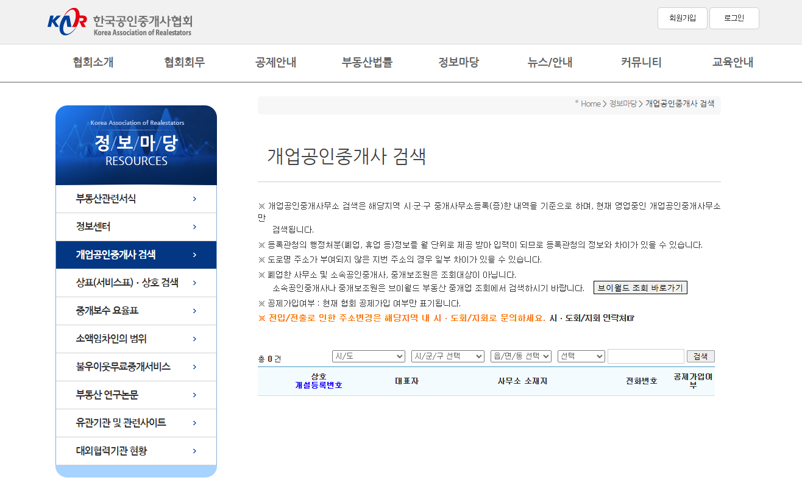

## 팟캐스트 영상제작 (5분 영상)-냥집사와 꼬꼬의 랜선 집들이 
네, 요청하신 대로 팟캐스트 스토리보드를 SRT(자막) 형식으로 변환해 드리겠습니다. 각 대화의 흐름에 맞춰 시간 코드를 나누고, 화자를 명확하게 표시했습니다.

코드 스니펫

1
00:00:00,000 --> 00:00:03,500
냥집사: "안녕, 집사들! 그리고 오늘도 평화로운 꼬꼬 님."

2
00:00:03,500 --> 00:00:08,000
꼬꼬: "안녕하세요! 냥집사 님, 그리고 우리의 사랑스러운 청취자 여러분. 꼬꼬예요! 꼬꼬꼬!"

3
00:00:08,000 --> 00:00:16,000
냥집사: "오늘도 꼬꼬가 꼬꼬댁거리는 소리로 시작하는 '냥집사와 꼬꼬의 랜선 집들이'입니다. 오늘은 특별히 첫 독립을 앞두고 있는 자취생들을 위한 꿀팁을 준비했죠. 꼬꼬도 예전에 집 구하느라 고생 좀 했다면서요?"

4
00:00:16,000 --> 00:00:23,500
꼬꼬: "네! 정말 꼬생했습니다! 집이 다 똑같은 집인 줄 알았는데, 아니더라고요. 그래서 오늘은 꼬꼬가 직접 겪은 좌충우돌 집 구하기 썰과 함께, 냥집사 님이 알려주는 정석 꿀팁을 함께 풀어볼게요!"

5
00:00:23,500 --> 00:00:29,000
냥집사: "본격적인 꿀팁에 앞서, 꼬꼬 님은 첫 자취 시작할 때 가장 당황스러웠던 순간이 있었나요?"

6
00:00:29,000 --> 00:00:36,500
꼬꼬: "아, 있죠! 꼬꼬는 집주인 아저씨가 '여름에 전기세 엄청 나온다'고 하셔서 에어컨 안 틀고 버티다가 털 다 빠질 뻔했다꼬!"

7
00:00:36,500 --> 00:00:43,000
냥집사: "저는 벽에 못 박는 게 이렇게 어려운지 몰랐어요. 망치질 한 번에 옆집에서 득달같이 달려오셔서 혼났어요. (웃음)"

8
00:00:43,000 --> 00:00:50,000
냥집사: "이런 시행착오를 줄여드리기 위해, 저희가 준비한 팁을 지금부터 시작합니다!"

9
00:00:50,000 --> 00:00:55,000
냥집사: "첫 번째 팁입니다. 무작정 부동산에 찾아가면 안 됩니다. 일단 온라인 매물을 꼼꼼히 체크해야 합니다."

10
00:00:55,000 --> 01:02,500
꼬꼬: "맞아요! 꼬꼬는 대충 사진만 보고 '와, 넓다!' 하고 갔는데… 사진은 광각 렌즈였다는 걸 그때 알았어요. 문 열고 들어가자마자 냥집사님 몸만 한 방이 있어서 당황했다꼬."

11
01:02,500 --> 01:11,000
냥집사: "바로 그거죠. 사진은 뻥튀기가 심해요. 그래서 가장 중요한 건, 나만의 체크리스트를 만드는 겁니다. 보증금, 월세, 관리비는 물론이고, 내가 포기할 수 없는 옵션들 있잖아요. 에어컨, 세탁기, 주차 여부 같은 것들요. 이걸 딱 정해두고 가야 쓸데없는 곳에 시간 낭비 안 합니다."

12
01:11,000 --> 01:16,000
꼬꼬: "아, 꼬꼬는 '수납공간'을 체크리스트에 넣었어야 했는데! 꼬꼬처럼 예쁜 옷이 많은 사람은 옷장 크기가 중요하거든요."

13
01:16,000 --> 01:25,000
냥집사: "옷장이라… (피식) 그리고 꼭! 부동산 방문 전에 '이 매물 보고 싶다'는 걸 미리 찝어서 연락해야 합니다. 그럼 공인중개사님이 동선에 맞춰서 매물을 보여주시거든요. 시간도 아끼고, 괜히 끌려다닐 필요도 없죠."

14
01:25,000 --> 01:34,000
냥집사: "추가로, 여러분이 어떤 집에 살고 싶은지부터 정해야 해요. 원룸, 오피스텔, 다가구, 다세대… 이름도 비슷하고 헷갈리죠?"

15
01:34,000 --> 01:41,000
냥집사: "오피스텔은 주로 깔끔한 시설에 보안이 좋지만 관리비가 비싸고, 다가구는 가격이 저렴한 대신 불편한 점이 있을 수 있어요."

16
01:41,000 --> 01:45,000
냥집사: "이런 특징을 알고 가면 훨씬 유리합니다."

17
01:45,000 --> 01:50,000
냥집사: "자, 드디어 대망의 방 보러 가는 날! 꼬꼬, 냥집사들이 방에 딱 들어갔을 때, 제일 먼저 뭘 해야 할까요?"

18
01:50,000 --> 01:53,000
꼬꼬: "음… '와, 이쁘다!' 하고 감탄사부터 내뱉는다꼬?"

19
01:53,000 --> 01:59,500
냥집사: "아니죠! 가장 중요한 건, '냄새를 맡아보는 겁니다.' (킁킁) 특히 습하고 퀴퀴한 곰팡이 냄새나 하수구 냄새가 나는지 확인해야 해요."

20
01:59,500 --> 02:04,500
냥집사: "고양이들은 냄새에 예민하거든요. 냄새는 곧 그 집의 위생 상태를 보여주는 지표입니다."

21
02:04,500 --> 02:10,000
꼬꼬: "맞아요! 꼬꼬는 해가 잘 드는 곳을 봐야 한다꼬! 햇빛이 잘 들어야 꼬꼬가 알을 낳... 아니, 아니! 이불을 말리거나 꼬꼬의 뽀송한 털을 관리하기 좋다꼬!"

22
02:10,000 --> 02:24,000
냥집사: "좋은 지적입니다. 햇빛은 낮에만 볼 수 있으니까, 꼭 낮에 방문해야 하고요. 추가로, **'수압'과 '배수'**를 꼭 확인하세요. 싱크대랑 화장실 물 틀어놓고, 변기 물도 내려보고! 소음도 중요합니다. 근처에 공사장이 있거나, 차가 많이 다니는지 창문을 열어 소리를 들어봐야 합니다."

23
02:24,000 --> 02:35,000
냥집사: "그리고 꼬꼬, 이게 정말 중요한 팁인데, **모든 전등을 켜보세요.** 콘센트가 제대로 작동하는지도 확인해야 하고요. 또, 창문을 열어 환기가 잘 되는지도 체크해야 합니다. 이런 사소한 것들이 나중에 큰 불편함을 만들거든요. 집을 볼 때는 '내 집'이라고 생각하고 꼼꼼히 체크하세요!"

24
02:35,000 --> 02:44,000
냥집사: "그리고 보일러실에 가서 **전기, 가스, 수도 계량기**를 꼭 확인해야 합니다. 이전 세입자가 얼마나 썼는지 눈으로 직접 보고 사진을 찍어두면, 나중에 요금 폭탄을 맞을 일도 없어요!"

25
02:44,000 --> 02:49,000
냥집사: "마지막으로, 마음에 드는 집을 찾았으면 이제 계약입니다. 꼬꼬, 계약서에 도장 찍기 전에 뭘 제일 먼저 확인해야 할까요?"

26
02:49,000 --> 02:52,000
꼬꼬: "음... 냥집사님이 제 이름 잘 썼는지 확인한다꼬?"

27
02:52,000 --> 02:59,000
냥집사: "그것도 중요하지만, 더 중요한 게 있습니다. 바로 **'등기부등본'**입니다. '갑구'에 소유권에 문제가 없는지, '을구'에 근저당이나 빚은 없는지 확인해야 합니다. 안전한 거래의 기본 중의 기본이죠."

28
02:59,000 --> 03:06,000
꼬꼬: "꼬꼬는 특약사항이 중요하다꼬! 꼬꼬는 집주인에게 '꼬꼬가 닭이라고 놀리면 안 된다'는 특약사항을 넣고 싶었거든요!"

29
03:06,000 --> 03:17,000
냥집사: "특약도 중요하죠. 특히 옵션 품목 상태를 사진으로 남겨두고, 계약서에 '파손 시 집주인과 협의' 같은 문구를 넣으면 좋습니다. 그리고 계약하기 전에 관리비에 포함되는 항목이 뭔지도 미리 물어봐야 합니다. 인터넷, 수도세 포함인지, 엘리베이터 이용료가 따로 있는지 등."

30
03:17,000 --> 03:27,000
냥집사: "또, **계약서의 작은 글씨**를 꼭 읽어보세요. '계약 중도 해지 시 위약금', '수리 책임 소재' 같은 조항들이 있어요. 예를 들어, 보일러가 고장 났을 때 집주인이 고쳐주는지, 아니면 세입자가 고쳐야 하는지 꼭 확인해야 나중에 당황하지 않습니다."

31
03:27,000 --> 03:36,000
냥집사: "그리고 무엇보다 가장 중요한 것! 계약 후에는 반드시 **'전입신고'**와 **'확정일자'**를 받으세요. 이 두 가지만 있으면 여러분의 소중한 보증금을 법적으로 안전하게 보호받을 수 있습니다."

32
03:36,000 --> 03:42,000
냥집사: "그리고, 진짜 중요한 거 하나 더! 혹시라도 집주인과 문제가 생길까 봐 걱정하는 분들 많잖아요?"

33
03:42,000 --> 03:46,500
꼬꼬: "맞아요! 꼬꼬는 '꼬꼬라고 놀리면 어떡하지?'라는 걱정부터 했다꼬…."

34
03:46,500 --> 03:58,000
냥집사: "그럴 때, 혼자 고민하지 말고 **주택임대차분쟁조정위원회**를 이용하면 됩니다. 소송보다 훨씬 빠르고 저렴하게 문제를 해결할 수 있어요. 그리고 계약할 때, 계약서에 서명하는 분이 그 부동산의 **대표 공인중개사**가 맞는지도 꼭 확인해야 합니다."

35
03:58,000 --> 04:05,000
냥집사: "**한국공인중개사협회**나 **국가공간정보포털**에서 검색하면 바로 나와요. 이 작은 확인 한 번으로 여러분의 소중한 보증금을 지킬 수 있습니다. 귀찮아하지 말고 꼭 확인하세요!"

36
04:05,000 --> 04:12,000
냥집사: "오늘 저희가 준비한 첫 자취방 구하기 꿀팁, 어떠셨나요? 여러분의 안전하고 행복한 독립을 위해 저희가 준비한 작은 팁들이 도움이 되었으면 좋겠네요."

37
04:12,000 --> 04:17,500
꼬꼬: "꼬꼬도 나중에 더 똑똑한 집을 구하겠다꼬! 첫 독립을 앞둔 모든 분들, 파이팅이에요! 꼬꼬가 응원한다꼬!"

38
04:17,500 --> 04:22,500
냥집사: "저희 팟캐스트는 매주 목요일, 여러분의 삶의 질을 높여주는 꿀팁으로 찾아오겠습니다. 다음 주에 또 만나요!"

39
04:22,500 --> 04:24,500
꼬꼬: "안녕! 꼬꼬꼬!"

## 동물 캐릭터 이미지 
https://labs.google/fx/ko/tools/whisk/share/691rk2sv80000
https://labs.google/fx/ko/tools/whisk/share/2up3c8fkr0000

## 신빙성 자료

## 배경 화면
https://labs.google/fx/tools/whisk/share/5bms2ov18g000

